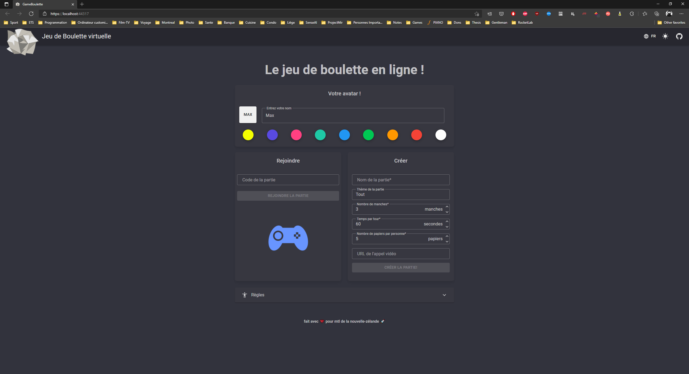
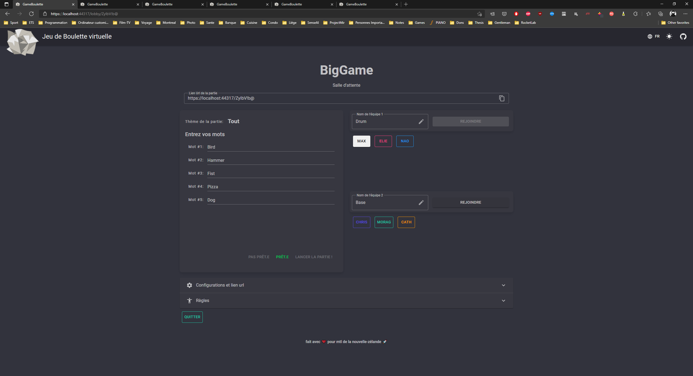
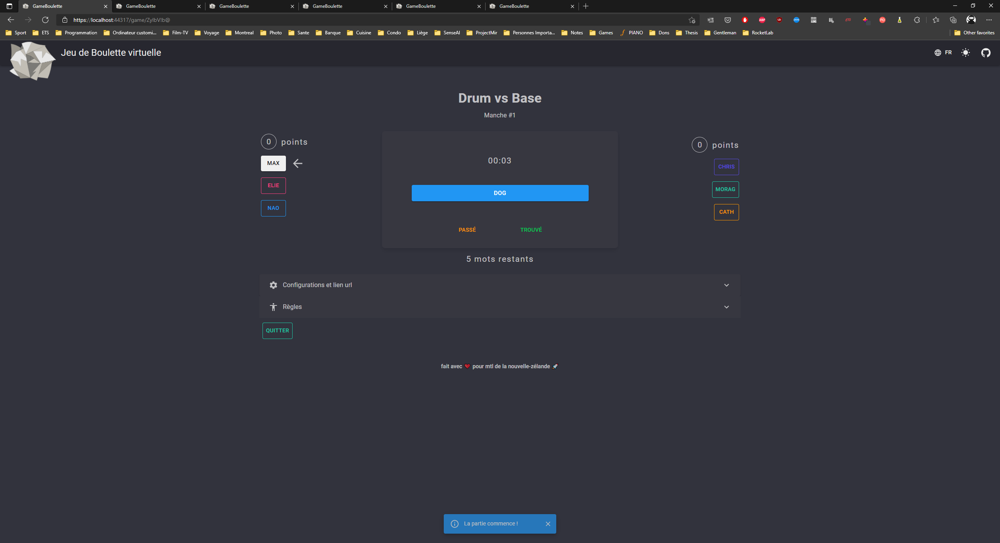
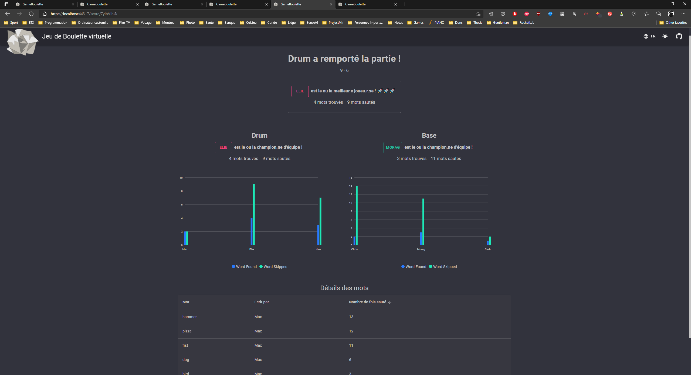

 


<a href="https://jeu-boulette.maxthom.ca/">Play here ! (https://jeu-boulette.maxthom.ca/)</a>

# Project GameBoulette
The goal of this project is create a support for the game Boulette.
It is a fun game to enjoy with your friends. With the pandemic, this webapp allow you and your friend to play virtually. Enjoy :)

# Motivation
The motivation behind this project is too give us some joy during the pandemic.
Moreover, the second goal is too push my skills with front end development with Blazor and websockets using SignalR.

# Features
- Play Boulette in real-time with your friend.
- Configure different setting for your game
- Cool statistics at the end of a game

# How to use
#### **Create a game**
- Set your name and player color
- Fill in the create game form.
- On the lobby page, share the link with your friends
#### **Join a game**
- Use the link provided by the game host
- Set your name and player color
- Click on Join Game

# Technologies
 - C#
 - Blazor
 - MudBlazor
 - SignalR
 - Digital Ocean

# Coding
## To run using HotReload
1. Add ```"hotReloadProfile": "blazorwasm"``` in profiles in ```launchSettings.json```
2. Use ```dotnet watch``` inside client project folder in terminal
3. If change type is not supported, it will restart the app. Check terminal and set to always.

## Docker
### To build
1. In solution folder
2. Run ```docker build -t maxthom/game-boulette -f .\GameBoulette.Server\Dockerfile .```

### To run
1. Run ```docker run -d -p 49116:80 -p 49115:443 --name GameBoulette maxthom/game-boulette```
2. Navigate to ```http://localhost:49116```

# Credits
n/a

# Liscense
MIT

# RoadMap
*August 2021*
- [x] Create basic UI
- [x] Add French and English languages
- [x] Add Dark and Light themes
- [x] Add real-time game server
- [x] Deploy on Digital Ocean
- [x] Set CICD pipeline 
- [x] Add a statistics page at the end of a game

# Pictures



